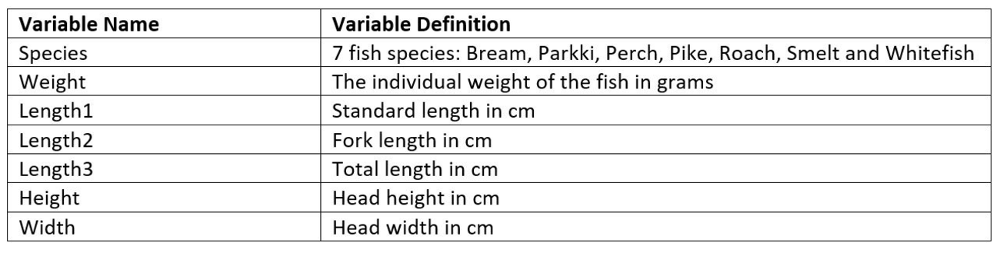
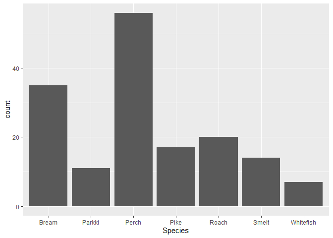

Team
- [Rajvir Sangha](https://github.com/rajvirsangha)
- [Xueqi Du](https://github.com/kkaydo)
- [Yanrong Shi](https://github.com/yannis-0220)

### Abstract

Fishes are among the most distinctive group of vertebrates consisting of
more than 33,000 known species and they are salient in various sectors
such as farming, processing, products, and marketing. Further, a vital
part after harvesting fish is to ascertain their proportions and weight,
where measuring individual weights can be expensive and time-consuming.

Therefore, the fishing industry necessitates methods to identify the
weight of different species to operate proficiently. This project aims
to explore statistical multilinear regression modeling to determine ways
to identify the fish weight by its dimensions for commonly seen fish
species at a fish market.

### Introduction

The fishing industry plays an important role directly in the livelihood
of millions, it was reported that at the start of the 21st century an
estimated 250 million people worldwide were directly employed by the
industry and an estimated one billion people rely on fish as their
primary source of protein. There has been radical advancement of fishing
technology throughout history which includes larger shipping vessels,
sophisticated fishing equipment, numerous food preservation methods etc.
However, these technologies are costly and heavily time-consuming and
thus, this project investigates cost-effective methods to weigh fishes
where the fish species and their proportions are known. The resulting
models immensely benefit the entities that need to weigh individual fish
on a day-to-day basis.

The fish dataset is composed of 159 observations and one additional
observation is introduced to the dataset that impacts the analysis which
will be discussed in depth in the sections that follow. The following
are the questions of interest:

1.  Is there a linear relationship between the Lengths variables,
    Height, Width, and Weight for all species?

2.  If so, does this relationship vary by species?

3.  Is there an effective model that can predict the individual fish
    weights for a specified species by using the fish dimensions?

### Data description

#### First impressions with various plots and the new data observation:

The aforementioned new additional data point is created for the
Whitefish species primarily due to its low count seen in the histogram
above. Furthermore, the rest of its numerical variables are calculated
by the median average and then appended to the fish dataset.

From the plots, it is visible that weight (response variable) and
dimensions of the fish (predictor variables) are positively related,
however, the association is not linear. The proper type of
transformation will be implemented at a later stage.

### Methods

    # Checking for the presence of multicollinearity in the independent variables

    # Correlation between variables
    correlation <- cor(FishMarket[,-1])
    corrplot(correlation,method = "number")

    # Eigenvalues
    X <- cbind(FishMarket$Length1,FishMarket$Length2,FishMarket$Length3,
               FishMarket$Height,FishMarket$Width)
    XX=t(X)%*%X
    lambda = eigen(XX)$values
    indices=max(lambda)/lambda
    names(FishMarket[,which(indices>1000)])

    ## [1] "Length1" "Length2" "Length3"

The correlation plot highlights the high correlation of 0.99 between all
length variables. Also, applying the eigenvalues method for all the
variables, the output shows that the indices values are greater than
1000 for all of the lengths which means multicollinearity will be an
issue if all of the lengths are included. Thus, only Length3 will be
considered for the multilinear regression model because it is the total
length of the fish.

    # Three different models are compared to check which dimension variable is the most significant:
    test.model <- lm(Weight ~ Length3+Width+Height - 1,data = FishMarket)

    dummy.lg.model <- lm(Weight ~ Length3+Width+Height+Length3:Species - 1,data = FishMarket)
    dummy.wd.model <- lm(Weight ~ Length3+Width+Height+Width:Species - 1,data = FishMarket)
    dummy.hg.model <- lm(Weight ~ Length3+Width+Height+Height:Species - 1,data = FishMarket)

    print(anova(test.model,dummy.lg.model))

    ## Analysis of Variance Table
    ## 
    ## Model 1: Weight ~ Length3 + Width + Height - 1
    ## Model 2: Weight ~ Length3 + Width + Height + Length3:Species - 1
    ##   Res.Df     RSS Df Sum of Sq     F    Pr(>F)    
    ## 1    157 7514056                                 
    ## 2    151 4526581  6   2987475 16.61 1.175e-14 ***
    ## ---
    ## Signif. codes:  0 '***' 0.001 '**' 0.01 '*' 0.05 '.' 0.1 ' ' 1

    print(anova(test.model,dummy.wd.model))

    ## Analysis of Variance Table
    ## 
    ## Model 1: Weight ~ Length3 + Width + Height - 1
    ## Model 2: Weight ~ Length3 + Width + Height + Width:Species - 1
    ##   Res.Df     RSS Df Sum of Sq      F    Pr(>F)    
    ## 1    157 7514056                                  
    ## 2    151 4763426  6   2750630 14.532 4.711e-13 ***
    ## ---
    ## Signif. codes:  0 '***' 0.001 '**' 0.01 '*' 0.05 '.' 0.1 ' ' 1

    print(anova(test.model,dummy.hg.model))

    ## Analysis of Variance Table
    ## 
    ## Model 1: Weight ~ Length3 + Width + Height - 1
    ## Model 2: Weight ~ Length3 + Width + Height + Height:Species - 1
    ##   Res.Df     RSS Df Sum of Sq      F    Pr(>F)    
    ## 1    157 7514056                                  
    ## 2    151 4749045  6   2765011 14.653 3.787e-13 ***
    ## ---
    ## Signif. codes:  0 '***' 0.001 '**' 0.01 '*' 0.05 '.' 0.1 ' ' 1

Hypothesis for all the ANOVA tests:

Null hypothesis: The interaction terms are equal to 0

Alternate hypothesis: The interaction terms are non-zero

The ANOVA tests are conducted to compares the different models that
include the species interaction term and models without the interaction
term. All the p-values are less than alpha of 0.05 and we reject the
null hypothesis that the interaction terms are zero and conclude that
there is a relationship between the dimensions of the fish and the
species interaction terms. Note that the Length:Species is the most
significant interaction term because it has the smallest p-value.

    ## Species correlation plot
    Dummy.data <- fastDummies::dummy_cols(FishMarket, select_columns = "Species")
    Dummy.data <- Dummy.data[,-c(1,3,4,5,6,7)]
    corrplot(cor(Dummy.data),method = "number")

The correlation plot of weight VS. the indicator species variables. From
the plot, it is shown that there won't be any multicollinearity issues.

    # Transformation Model:

    # Original model
    linear.model <- lm(Weight ~Length3+Height+Width,data = FishMarket)
    summary(linear.model)

    ## 
    ## Call:
    ## lm(formula = Weight ~ Length3 + Height + Width, data = FishMarket)
    ## 
    ## Residuals:
    ##     Min      1Q  Median      3Q     Max 
    ## -247.17  -76.73  -34.19   82.68  452.60 
    ## 
    ## Coefficients:
    ##             Estimate Std. Error t value Pr(>|t|)    
    ## (Intercept) -521.015     29.270 -17.800  < 2e-16 ***
    ## Length3       19.535      1.802  10.839  < 2e-16 ***
    ## Height         3.959      3.837   1.032    0.304    
    ## Width         61.875     14.440   4.285 3.19e-05 ***
    ## ---
    ## Signif. codes:  0 '***' 0.001 '**' 0.01 '*' 0.05 '.' 0.1 ' ' 1
    ## 
    ## Residual standard error: 126.1 on 156 degrees of freedom
    ## Multiple R-squared:  0.8776, Adjusted R-squared:  0.8752 
    ## F-statistic: 372.7 on 3 and 156 DF,  p-value: < 2.2e-16

    # Square root transformation on weight(response variable)
    sq.trans.FishMarket <- FishMarket
    sq.trans.FishMarket$Weight <- sqrt(sq.trans.FishMarket$Weight)
    sq.trans.model <- lm(Weight ~Length3+Height+Width,data = sq.trans.FishMarket[,-1])
    summary(sq.trans.model)

    ## 
    ## Call:
    ## lm(formula = Weight ~ Length3 + Height + Width, data = sq.trans.FishMarket[, 
    ##     -1])
    ## 
    ## Residuals:
    ##      Min       1Q   Median       3Q      Max 
    ## -11.2560  -0.6526  -0.1246   0.7120   4.8714 
    ## 
    ## Coefficients:
    ##             Estimate Std. Error t value Pr(>|t|)    
    ## (Intercept) -7.09061    0.36729 -19.305  < 2e-16 ***
    ## Length3      0.41783    0.02262  18.475  < 2e-16 ***
    ## Height       0.30414    0.04814   6.318 2.65e-09 ***
    ## Width        2.04404    0.18120  11.281  < 2e-16 ***
    ## ---
    ## Signif. codes:  0 '***' 0.001 '**' 0.01 '*' 0.05 '.' 0.1 ' ' 1
    ## 
    ## Residual standard error: 1.582 on 156 degrees of freedom
    ## Multiple R-squared:  0.9709, Adjusted R-squared:  0.9704 
    ## F-statistic:  1738 on 3 and 156 DF,  p-value: < 2.2e-16

    ## Log transformation on weight
    log.trans.FishMarket <- FishMarket
    log.trans.FishMarket$Weight <- log(log.trans.FishMarket$Weight)
    log.trans.FishMarket[which(log.trans.FishMarket$Weight==0),]

    ## [1] Species Weight  Length1 Length2 Length3 Height  Width  
    ## <0 rows> (or 0-length row.names)

    log.trans.FishMarket<-log.trans.FishMarket[-41,]
    log.trans.model <- lm(Weight ~Length3+Height+Width,data = log.trans.FishMarket[,-1])
    summary(log.trans.model)

    ## 
    ## Call:
    ## lm(formula = Weight ~ Length3 + Height + Width, data = log.trans.FishMarket[, 
    ##     -1])
    ## 
    ## Residuals:
    ##     Min      1Q  Median      3Q     Max 
    ## -1.1891 -0.1966  0.1075  0.2782  0.6029 
    ## 
    ## Coefficients:
    ##             Estimate Std. Error t value Pr(>|t|)    
    ## (Intercept) 1.957022   0.084901  23.051  < 2e-16 ***
    ## Length3     0.041712   0.005213   8.002 2.68e-13 ***
    ## Height      0.058683   0.011093   5.290 4.10e-07 ***
    ## Width       0.366512   0.041751   8.779 2.86e-15 ***
    ## ---
    ## Signif. codes:  0 '***' 0.001 '**' 0.01 '*' 0.05 '.' 0.1 ' ' 1
    ## 
    ## Residual standard error: 0.3645 on 155 degrees of freedom
    ## Multiple R-squared:  0.9255, Adjusted R-squared:  0.9241 
    ## F-statistic: 642.2 on 3 and 155 DF,  p-value: < 2.2e-16

Three different models are considered: no transformation, square root
transformation on the weight variable and log transformation on the
weight variable. From the output, we can conclude let the square root
transformation is the best choice for the highest R-square value of
0.9709.

    # Variable Selection:
    temp.model <- lm(Weight~Height + Width + Length3 + factor(Species) + 
                       Height:Species + Width:Species + Length3:Species,data = FishMarket)

    # Stepwise regression model (AIC)
    stepwise <- stepAIC(temp.model, direction = "both", trace = FALSE)
    summary(stepwise)

    ## 
    ## Call:
    ## lm(formula = Weight ~ Height + Width + Length3 + factor(Species) + 
    ##     Length3:Species, data = FishMarket)
    ## 
    ## Residuals:
    ##      Min       1Q   Median       3Q      Max 
    ## -179.505  -34.284   -3.668   24.402  311.250 
    ## 
    ## Coefficients:
    ##                           Estimate Std. Error t value Pr(>|t|)    
    ## (Intercept)              -1075.382    114.409  -9.399  < 2e-16 ***
    ## Height                      51.186     14.290   3.582 0.000466 ***
    ## Width                       39.493     20.275   1.948 0.053372 .  
    ## Length3                     18.295      6.169   2.966 0.003537 ** 
    ## factor(Species)Parkki      815.880    172.636   4.726 5.39e-06 ***
    ## factor(Species)Perch       495.552    116.792   4.243 3.93e-05 ***
    ## factor(Species)Pike       -527.488    143.243  -3.682 0.000326 ***
    ## factor(Species)Roach       780.800    151.338   5.159 8.07e-07 ***
    ## factor(Species)Smelt      1123.893    211.618   5.311 4.05e-07 ***
    ## factor(Species)Whitefish  -151.809    211.523  -0.718 0.474107    
    ## Length3:SpeciesParkki      -25.825      6.343  -4.071 7.68e-05 ***
    ## Length3:SpeciesPerch        -5.707      3.914  -1.458 0.146948    
    ## Length3:SpeciesPike         17.131      5.030   3.405 0.000856 ***
    ## Length3:SpeciesRoach       -19.917      5.405  -3.685 0.000323 ***
    ## Length3:SpeciesSmelt       -33.894     14.300  -2.370 0.019101 *  
    ## Length3:SpeciesWhitefish    11.508      6.364   1.808 0.072639 .  
    ## ---
    ## Signif. codes:  0 '***' 0.001 '**' 0.01 '*' 0.05 '.' 0.1 ' ' 1
    ## 
    ## Residual standard error: 70.13 on 144 degrees of freedom
    ## Multiple R-squared:  0.965,  Adjusted R-squared:  0.9614 
    ## F-statistic: 264.8 on 15 and 144 DF,  p-value: < 2.2e-16

The stepwide model selection by Akaike Information Criterion (AIC) is
used and the best model is with Height, Width3, Length3, Species and the
Length3:Species interaction term.

    # Cross Validation:

    # Data splitting
    set.seed(350)
    nsamp=ceiling(0.8*length(FishMarket$Weight))
    training_samps=sample(c(1:length(FishMarket$Weight)),nsamp)
    training_samps=sort(training_samps)
    train_data <- FishMarket[training_samps, ]
    test_data <- FishMarket[-training_samps, ]

    train_data$Weight <- sqrt(train_data$Weight)
    test_data$Weight <- sqrt(test_data$Weight)

    # Fitting model
    myModel <- lm(Weight~Height + Width + Length3 + factor(Species) + Length3:Species,data = train_data)
    summary(myModel)

    ## 
    ## Call:
    ## lm(formula = Weight ~ Height + Width + Length3 + factor(Species) + 
    ##     Length3:Species, data = train_data)
    ## 
    ## Residuals:
    ##      Min       1Q   Median       3Q      Max 
    ## -10.0574  -0.5249   0.0440   0.5319   2.8046 
    ## 
    ## Coefficients:
    ##                           Estimate Std. Error t value Pr(>|t|)    
    ## (Intercept)              -11.58713    2.73460  -4.237 4.67e-05 ***
    ## Height                     0.75161    0.30606   2.456 0.015596 *  
    ## Width                      1.17253    0.44691   2.624 0.009911 ** 
    ## Length3                    0.47736    0.14019   3.405 0.000919 ***
    ## factor(Species)Parkki      6.39909    3.85070   1.662 0.099350 .  
    ## factor(Species)Perch       3.87302    2.77292   1.397 0.165256    
    ## factor(Species)Pike       -3.02790    3.36115  -0.901 0.369600    
    ## factor(Species)Roach       3.76941    3.44141   1.095 0.275730    
    ## factor(Species)Smelt      11.26389    5.19712   2.167 0.032327 *  
    ## factor(Species)Whitefish  -3.57768    5.30937  -0.674 0.501800    
    ## Length3:SpeciesParkki     -0.18253    0.14012  -1.303 0.195375    
    ## Length3:SpeciesPerch      -0.01144    0.09044  -0.126 0.899607    
    ## Length3:SpeciesPike        0.10088    0.11487   0.878 0.381713    
    ## Length3:SpeciesRoach      -0.07919    0.12134  -0.653 0.515363    
    ## Length3:SpeciesSmelt      -0.44830    0.36007  -1.245 0.215711    
    ## Length3:SpeciesWhitefish   0.20369    0.15436   1.320 0.189657    
    ## ---
    ## Signif. codes:  0 '***' 0.001 '**' 0.01 '*' 0.05 '.' 0.1 ' ' 1
    ## 
    ## Residual standard error: 1.356 on 112 degrees of freedom
    ## Multiple R-squared:  0.9814, Adjusted R-squared:  0.9789 
    ## F-statistic: 393.2 on 15 and 112 DF,  p-value: < 2.2e-16

    # Testing on the test data
    preds <- predict(myModel,test_data)
    plot(test_data$Weight,preds,main = "Test Data vs Prediction",xlab = "test data",ylab = "prediction")
    abline(c(0,1),col="red")

Using the cross validation method, we set 80% of the data to be training
samples which are used for building a model and the rest of the data is
used for testing the accuracy of the model. The Test Data vs Prediction
plot shows that the model is predicting effectively.

    # Regression Analysis
    plot(myModel,which = 1)

    plot(myModel,which = 2)

    plot(myModel,which = 3)

    plot(myModel,which = 5)

The Residuals vs Fitted plot has most of the fitted residuals around
zero.

The linear assumption is met after the square root transformation on the
response variable.

The Normal Q-Q plot shows that the normal distributed assumption is met.

The Standardized Residual plot shows that the constant variance
assumption is met.

The Residuals vs Leverage plot shows that the uncorrelated errors
assumption is met and most of the data is within the dashed lines of
Cook's distance.

However, observations 14, 41 and 143 need further investigation because
they have large residual and leverage value.

    # Residual Analysis 

    # Cook distance
    cook.dis<- cooks.distance(myModel)
    head(cook.dis)

    ##            1            2            3            5            7            9 
    ## 3.521241e-03 4.375785e-03 1.270302e-03 3.883087e-03 1.601143e-03 6.851746e-05

    train_data [which(cook.dis>1),] #points with high leverage

    ## [1] Species Weight  Length1 Length2 Length3 Height  Width  
    ## <0 rows> (or 0-length row.names)

    # Standardized Residual
    rstandard(myModel)

    ##            1            2            3            5            7            9 
    ## -0.456687223 -0.573190743  0.302185014  0.578449744  0.490330038 -0.122834314 
    ##           10           12           13           14           16           18 
    ##  0.120610595  0.167604036  0.859654015 -3.200794933  0.135570897  1.772186581 
    ##           19           20           21           22           23           24 
    ##  0.068352726  0.790939829 -0.907752432  0.554662197 -0.245221463 -0.418196121 
    ##           25           27           28           29           30           32 
    ## -0.036794359 -0.304571137 -0.595977090  0.707718947  0.737297898  0.410629654 
    ##           34           36           38           39           40           41 
    ## -0.841406309  1.756304260  0.481109978  0.280594615  0.833452528 -7.781042402 
    ##           42           44           45           46           47           48 
    ##  0.376903509  1.142809848  0.793197149  0.479723931  0.671001595  0.955325319 
    ##           49           52           54           55           57           59 
    ## -0.133983827  0.170967329  0.073261465  0.223278750  0.603470531 -0.469925551 
    ##           61           62           63           64           65           66 
    ##  0.646489519 -0.125367241  0.128482030  0.109909917  0.104068475  0.222819810 
    ##           67           68           69           70           72           73 
    ## -0.078593515  0.254305984 -0.712830633 -0.287129854  0.450211356  2.225989071 
    ##           74           75           77           78           79           80 
    ##  1.169118051  0.655359269  0.427753318  0.723689015 -0.047856179 -0.429470256 
    ##           82           83           84           86           87           88 
    ##  0.060009549 -0.546761102 -0.279074386 -0.339010816 -0.652189239 -0.490822228 
    ##           89           92           93           94           95           96 
    ## -0.418823089 -0.537984192 -0.434948578 -0.187784511  0.286829007  0.015189670 
    ##           97           98           99          100          101          102 
    ##  0.751845655 -1.048923188 -0.543365276 -0.283185136 -0.550062241 -0.608533931 
    ##          103          104          105          106          107          108 
    ## -0.467524125 -0.072325700  0.108614683 -0.574029420 -0.739795343 -0.094275733 
    ##          110          111          113          114          115          116 
    ## -0.038578210 -0.687225906 -0.387693447  0.340260529  0.245228423  0.195798131 
    ##          117          118          119          120          121          122 
    ##  0.989886612 -1.165916480 -0.664504920 -0.104728631  0.474030486  1.353257794 
    ##          123          124          125          126          127          128 
    ##  0.309643887  1.918164088  0.596787061  1.210836841 -0.869455913 -0.515547472 
    ##          129          131          133          134          135          136 
    ##  0.417549253 -0.084458721  0.877064667  0.008429906 -0.688593258  0.411350801 
    ##          137          138          140          141          142          144 
    ## -0.386118419 -1.359791531  0.527400683 -0.289458244 -0.648402497  2.259778187 
    ##          145          146          147          148          149          150 
    ## -0.915444502  0.056396971 -0.095104173 -0.011121188 -0.141464445  0.023256289 
    ##          151          152          153          154          156          157 
    ## -0.067198859 -0.049890756  0.044897381  0.051918482  0.218433859  0.186008226 
    ##          158          160 
    ## -0.272250457 -0.212940090

    stdRsidual<-rstandard(myModel)
    train_data[which(abs(stdRsidual)>3),]

    ##    Species   Weight Length1 Length2 Length3  Height  Width
    ## 14   Bream 18.43909    29.5    32.0    37.3 13.9129 5.0728
    ## 41   Roach  0.00000    19.0    20.5    22.8  6.4752 3.3516

After calculating the Cook's distance of each suspected observation, the
output shows that none of the points have Cook's distance larger than 1,
which means there is no high leverage point. However, observations 41
and 14 have standardized residuals that are larger than 3 which means
they might be considered as outliers.

    # Remove Outlier
    new_train_data <- train_data[-c(41,14),]

    # Fitting model
    new_myModel <- lm(Weight~Height + Width + Length3 + factor(Species) + Length3:Species,data = new_train_data)
    summary(new_myModel)

    ## 
    ## Call:
    ## lm(formula = Weight ~ Height + Width + Length3 + factor(Species) + 
    ##     Length3:Species, data = new_train_data)
    ## 
    ## Residuals:
    ##      Min       1Q   Median       3Q      Max 
    ## -10.0865  -0.5289   0.0350   0.5403   2.7748 
    ## 
    ## Coefficients:
    ##                            Estimate Std. Error t value Pr(>|t|)    
    ## (Intercept)              -1.140e+01  2.754e+00  -4.141 6.79e-05 ***
    ## Height                    8.177e-01  3.179e-01   2.572  0.01144 *  
    ## Width                     1.181e+00  4.746e-01   2.489  0.01429 *  
    ## Length3                   4.439e-01  1.449e-01   3.063  0.00276 ** 
    ## factor(Species)Parkki     6.229e+00  3.873e+00   1.608  0.11064    
    ## factor(Species)Perch      3.754e+00  2.789e+00   1.346  0.18115    
    ## factor(Species)Pike      -3.209e+00  3.383e+00  -0.949  0.34492    
    ## factor(Species)Roach      3.619e+00  3.461e+00   1.046  0.29808    
    ## factor(Species)Smelt      1.115e+01  5.224e+00   2.134  0.03504 *  
    ## factor(Species)Whitefish -6.197e+00  6.854e+00  -0.904  0.36786    
    ## Length3:SpeciesParkki    -1.768e-01  1.409e-01  -1.255  0.21227    
    ## Length3:SpeciesPerch      9.087e-04  9.248e-02   0.010  0.99218    
    ## Length3:SpeciesPike       1.228e-01  1.178e-01   1.043  0.29932    
    ## Length3:SpeciesRoach     -6.591e-02  1.230e-01  -0.536  0.59321    
    ## Length3:SpeciesSmelt     -4.322e-01  3.623e-01  -1.193  0.23543    
    ## Length3:SpeciesWhitefish  2.775e-01  1.884e-01   1.473  0.14362    
    ## ---
    ## Signif. codes:  0 '***' 0.001 '**' 0.01 '*' 0.05 '.' 0.1 ' ' 1
    ## 
    ## Residual standard error: 1.362 on 110 degrees of freedom
    ## Multiple R-squared:  0.9814, Adjusted R-squared:  0.9789 
    ## F-statistic: 387.3 on 15 and 110 DF,  p-value: < 2.2e-16

    summary(myModel)

    ## 
    ## Call:
    ## lm(formula = Weight ~ Height + Width + Length3 + factor(Species) + 
    ##     Length3:Species, data = train_data)
    ## 
    ## Residuals:
    ##      Min       1Q   Median       3Q      Max 
    ## -10.0574  -0.5249   0.0440   0.5319   2.8046 
    ## 
    ## Coefficients:
    ##                           Estimate Std. Error t value Pr(>|t|)    
    ## (Intercept)              -11.58713    2.73460  -4.237 4.67e-05 ***
    ## Height                     0.75161    0.30606   2.456 0.015596 *  
    ## Width                      1.17253    0.44691   2.624 0.009911 ** 
    ## Length3                    0.47736    0.14019   3.405 0.000919 ***
    ## factor(Species)Parkki      6.39909    3.85070   1.662 0.099350 .  
    ## factor(Species)Perch       3.87302    2.77292   1.397 0.165256    
    ## factor(Species)Pike       -3.02790    3.36115  -0.901 0.369600    
    ## factor(Species)Roach       3.76941    3.44141   1.095 0.275730    
    ## factor(Species)Smelt      11.26389    5.19712   2.167 0.032327 *  
    ## factor(Species)Whitefish  -3.57768    5.30937  -0.674 0.501800    
    ## Length3:SpeciesParkki     -0.18253    0.14012  -1.303 0.195375    
    ## Length3:SpeciesPerch      -0.01144    0.09044  -0.126 0.899607    
    ## Length3:SpeciesPike        0.10088    0.11487   0.878 0.381713    
    ## Length3:SpeciesRoach      -0.07919    0.12134  -0.653 0.515363    
    ## Length3:SpeciesSmelt      -0.44830    0.36007  -1.245 0.215711    
    ## Length3:SpeciesWhitefish   0.20369    0.15436   1.320 0.189657    
    ## ---
    ## Signif. codes:  0 '***' 0.001 '**' 0.01 '*' 0.05 '.' 0.1 ' ' 1
    ## 
    ## Residual standard error: 1.356 on 112 degrees of freedom
    ## Multiple R-squared:  0.9814, Adjusted R-squared:  0.9789 
    ## F-statistic: 393.2 on 15 and 112 DF,  p-value: < 2.2e-16

    # Testing on test data
    preds <- predict(myModel,test_data)
    plot(test_data$Weight,preds,main = "Test Data vs Prediction",xlab = "test data",ylab = "prediction")
    abline(c(0,1),col="red")

The suspected outliers (observations 41 and 14) are removed from the
fish dataset and a new model is fitted. The output shows that the
coefficients and R-square of the new model do not alter by much so the
observations 41 and 14 are kept in the dataset.

    # Robust Regression:
    rb.model <- rlm(Weight~Height + Width + Length3 + factor(Species) + Length3:Species,data = train_data)
    summary(rb.model)

    ## 
    ## Call: rlm(formula = Weight ~ Height + Width + Length3 + factor(Species) + 
    ##     Length3:Species, data = train_data)
    ## Residuals:
    ##        Min         1Q     Median         3Q        Max 
    ## -10.869442  -0.452267   0.001083   0.437610   3.118414 
    ## 
    ## Coefficients:
    ##                          Value    Std. Error t value 
    ## (Intercept)              -11.4759   1.4605    -7.8575
    ## Height                     0.7143   0.1635     4.3695
    ## Width                      1.2499   0.2387     5.2364
    ## Length3                    0.4810   0.0749     6.4242
    ## factor(Species)Parkki      6.3083   2.0566     3.0674
    ## factor(Species)Perch       3.5192   1.4810     2.3763
    ## factor(Species)Pike       -1.8800   1.7951    -1.0473
    ## factor(Species)Roach       6.2824   1.8380     3.4181
    ## factor(Species)Smelt      11.1776   2.7757     4.0270
    ## factor(Species)Whitefish  -3.7520   2.8356    -1.3231
    ## Length3:SpeciesParkki     -0.1833   0.0748    -2.4489
    ## Length3:SpeciesPerch      -0.0138   0.0483    -0.2847
    ## Length3:SpeciesPike        0.0670   0.0614     1.0920
    ## Length3:SpeciesRoach      -0.1631   0.0648    -2.5160
    ## Length3:SpeciesSmelt      -0.4554   0.1923    -2.3681
    ## Length3:SpeciesWhitefish   0.2001   0.0824     2.4276
    ## 
    ## Residual standard error: 0.6571 on 112 degrees of freedom

    # Points with least weight:
    head(order(rb.model$w))

    ## [1]  30  10 114  54  98  12

    # Testing on test data
    par(mfrow=c(1,2))
    preds <- predict(myModel,test_data)
    plot(test_data$Weight,preds,main = "Original Regression Model",xlab = "test data",ylab = "prediction")
    abline(c(0,1),col="red")
    preds.rb <- predict(rb.model,test_data)
    plot(test_data$Weight,preds.rb,main = "Robust Regression Model",xlab = "test data",ylab = "prediction")
    abline(c(0,1),col="blue")

Robust regression is applied on the train data, however, the weight is
not less on the potential outliers 41 and 14. It could be because they
are not influential to the original model. Comparing the Test Data vs
Prediction plot of the original model and robust model, there is little
difference and thus the original model is kept.

#### Results

From the methods conducted in the last section, we can deduce the
multilinear regression model for all the species:

For all species, the B0 is a constant and for every increment of one
centimeter of the fish dimensions, the height increases by b1, the width
increases by b2 and the length3 increases by b3.

The results can be implemented by a user to determine the Weight of any
of the 7 species by plugging in the dimensions of the fish in the model.

### Conclusion

Now in this final section, all the dots can be connected. The purpose of
this project is to create a multilinear regression model that allows the
user to calculate the individual weight of a fish while knowing the
height, the width, the total length (length3) and the species type.
Various statistical methods were implemented on the fish dataset to
build adequate multilinear regression models for all species.

These methods diligently answer our questions of purpose:

1.  Is there a linear relationship between the Lengths variables,
    Height, Width, and Weight?

    Yes, there is a linear positive relationship between the Length
    variables, Height, Width and Weight where square root transformation
    was applied to the Weight variable.

2.  If so, does this relationship vary by species?

    Yes, it varies for different species which is why the model has
    different intercepts and slopes based on the specific species.

3.  Is there an effective model that can predict the individual fish
    weights for a specified species by using the fish dimensions?

    Yes, the 7 multilinear regression models in the result section are
    effective models that can predict the individual fish weights for a
    specified species by using the fish dimensions.

Thus, these 7 multilinear regression models are ready to be used by the
fishing industry, particularly the entities who need to find the weight
for Bream, Roach, Whitefish, Parkki, Perch, Pike and Smelt while knowing
their dimensions.

### Appendix

The dataset is extracted from:
<a href="https://www.kaggle.com/aungpyaeap/fish-market" class="uri">https://www.kaggle.com/aungpyaeap/fish-market</a>

The R Markdown file and all additional files are available in the
repository.

